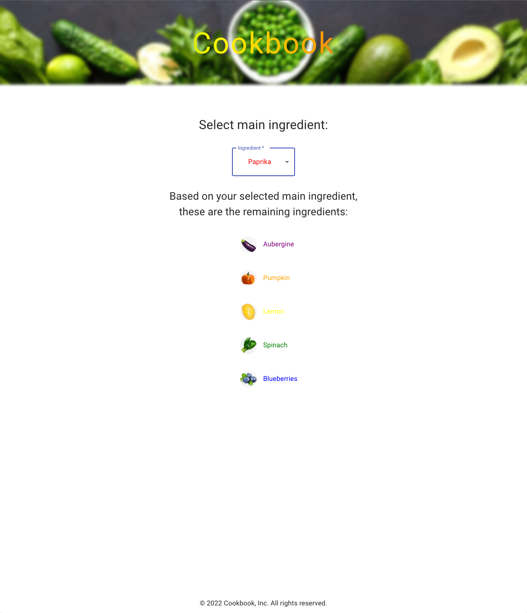
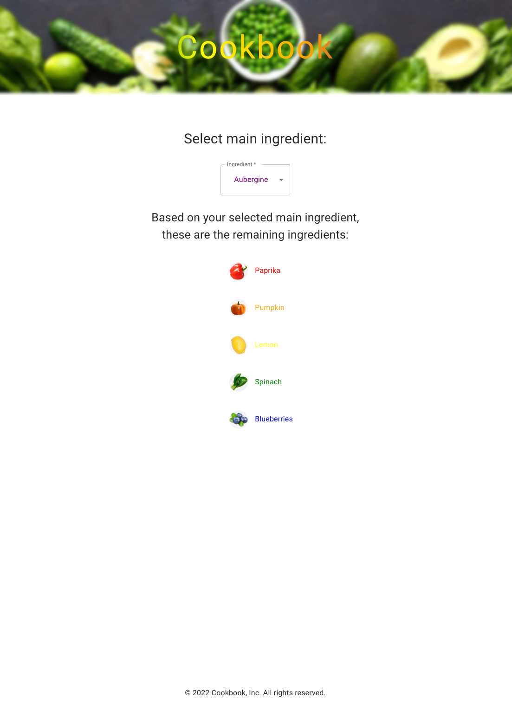

<div align="center">
  
</div>

# Cookbook

Cookbook app made during a coding challenge. <br /><br />
This Next.js project is the beginning of an online cookbook. It has a simple user interface which allow the user to select a main ingredient from a dropdown list, and based on the selection, it displays a list of the remaining ingredients.

## Technologies

This is a [Next.js](https://nextjs.org/) project bootstrapped with [`create-next-app`](https://github.com/vercel/next.js/tree/canary/packages/create-next-app).

## Setup

First of all clone the repo on your own machine

```bash
git clone https://github.com/lmguerrini/cookbook-api.git
```

Install all the dependencies required

```bash
npm install
```

Start the server

```bash
npm run dev
```

Now you should be ready to dive into the Cookbook app at http://localhost:3000

## Main features

-   Fetch ingredients from internal data API
-   Allow the user to select a main ingredient from a dropdown list
-   Based on user selection, the ingredient list displays the remaining ingredients
    <br />

## Preview

 &emsp; <br />
 &emsp; <br />


---

Go back to [**Cookbook**](#cookbook)
